# Use ESP32-C3-Super-Mini as OpenRemise Display

### With a large 2.4" Display 

<a href="images/display/IMG_20260419_114529.jpg">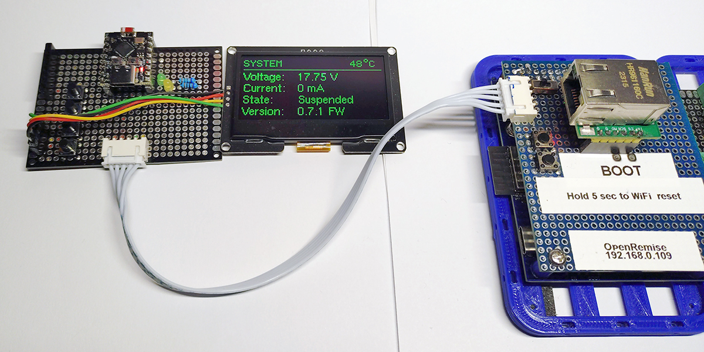</a>

### Compact Version with 1.3" Display

<a href="images/display/IMG_20260419_184033.jpg">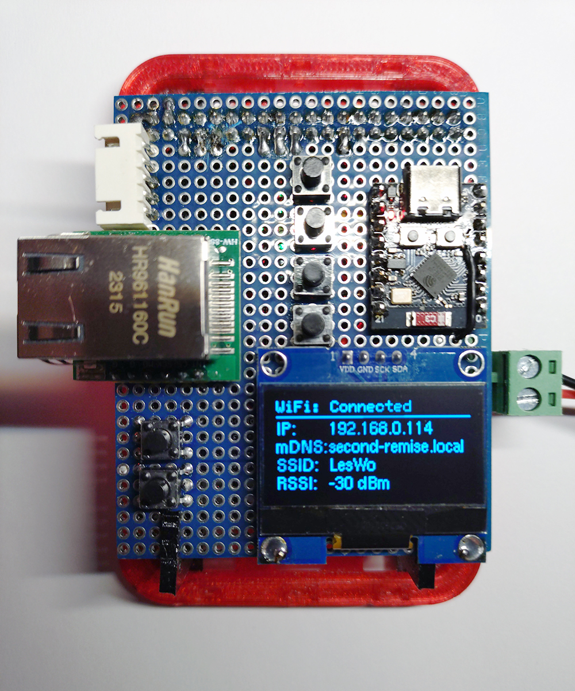</a>

The two reset buttons are connected here to reset the display synchronously.

### Used Hardware

- ESP32-C3 Super Mini
- any 128x64 OLED Display 
    - SSD1306
    - SH1106
    - SSD1309

### Hardware Connection

    OLED VCC -> C3 3.3V
    OLED GND -> C3 GND
    OLED SDA -> C3 GPIO 8
    OLED SCL -> C3 GPIO 9

    RX/TX Cross connection
    
    Btn 1 -> GPIO 4 Switch Views
    Btn 2 -> GPIO 5 (currently not in use)
    Btn 3 -> GPIO 6 (currently not in use)
    Btn 4 -> GPIO 7 (currently not in use)
      |-- -> GND
    
## Original Data

<table>
  <tr>
    <td valign="top">
      <a href="images/display/IMG_20260419_120004.jpg">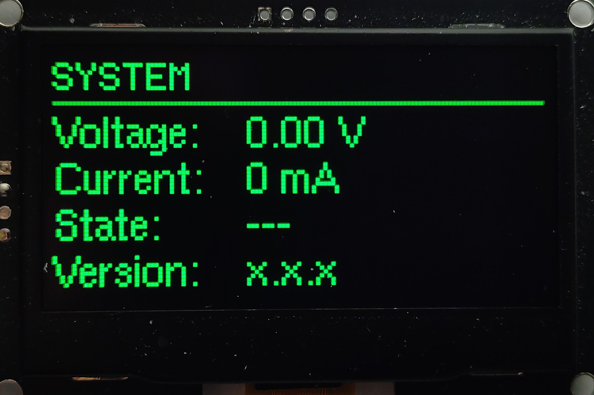</a>
    </td>
    <td valign="top">
      <a href="images/display/IMG_20260419_120010.jpg">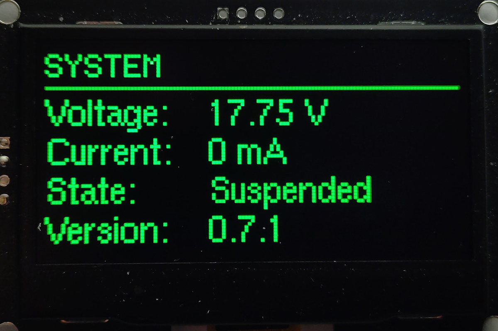</a>
    </td>
    <td valign="top">
      <a href="images/display/IMG_20260419_120047.jpg">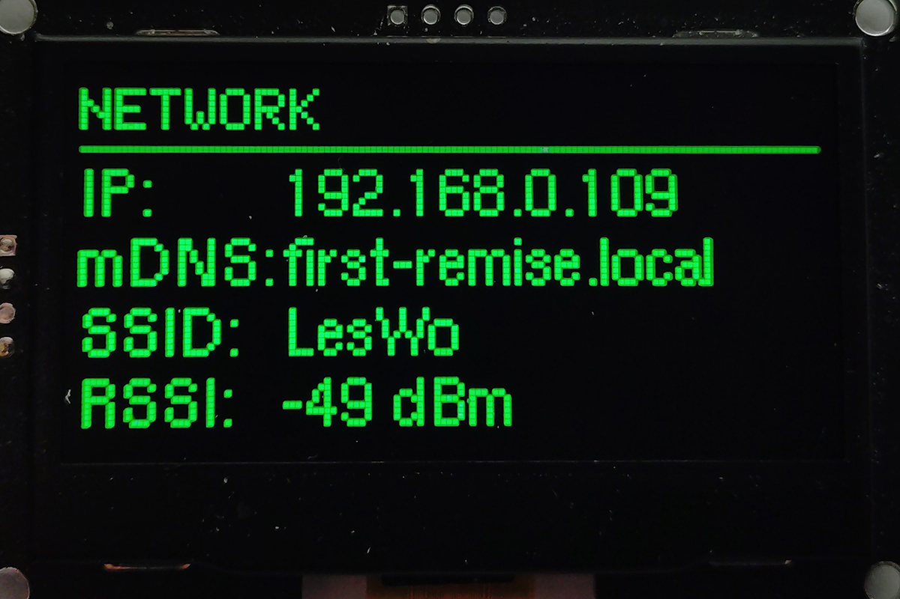</a>
    </td>
  </tr>
</table>

## Extended Data

<table>
  <tr>
    <td valign="top">
      <a href="images/display/IMG_20260419_114633.jpg">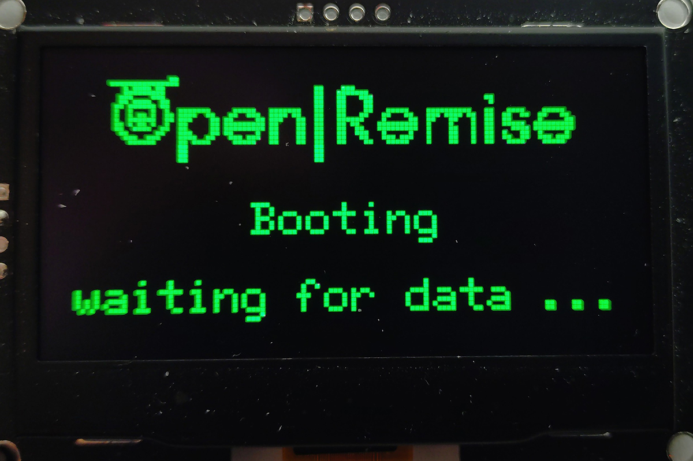</a>
    </td>
    <td valign="top">
      <a href="images/display/IMG_20260419_114645.jpg">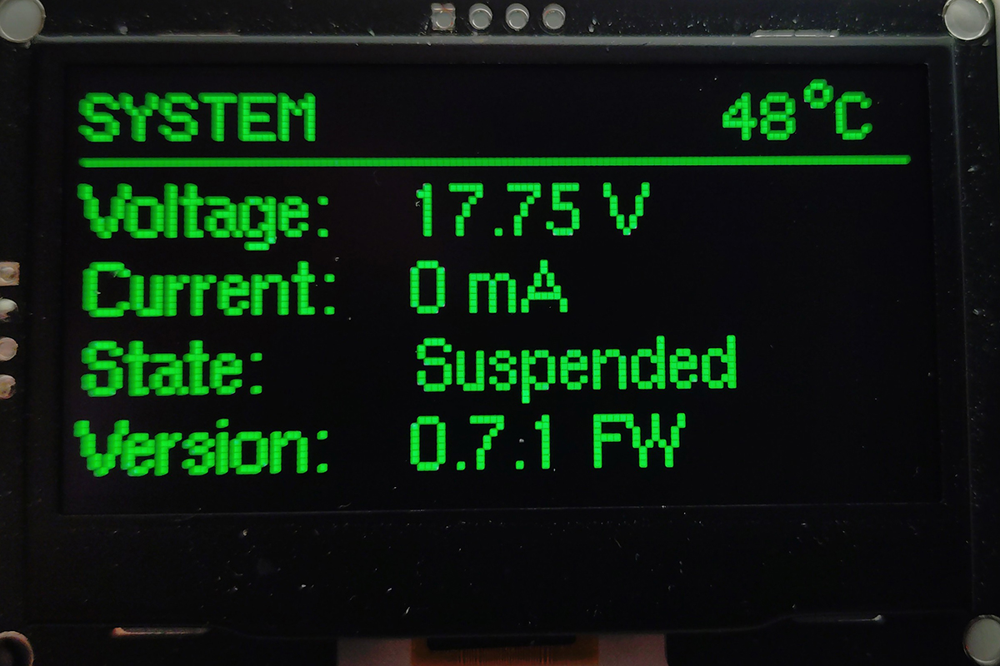</a>
    </td>
    <td valign="top">
      <a href="images/display/IMG_20260419_114746.jpg">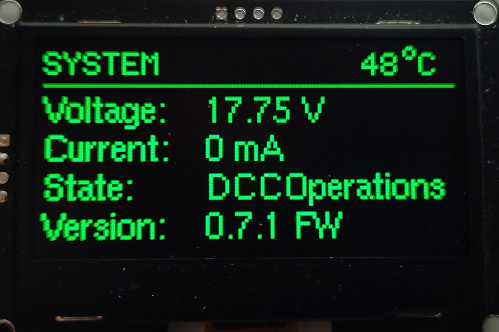</a>
    </td>
  </tr>
  <tr>
    <td valign="top">
      <a href="images/display/IMG_20260419_114826.jpg">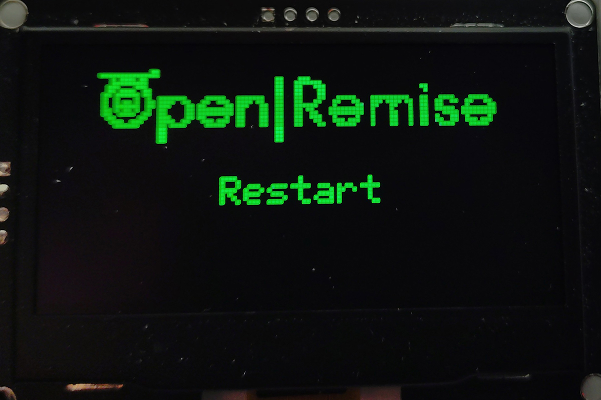</a>
    </td>
    <td valign="top">
      <a href="images/display/IMG_20260419_114837.jpg">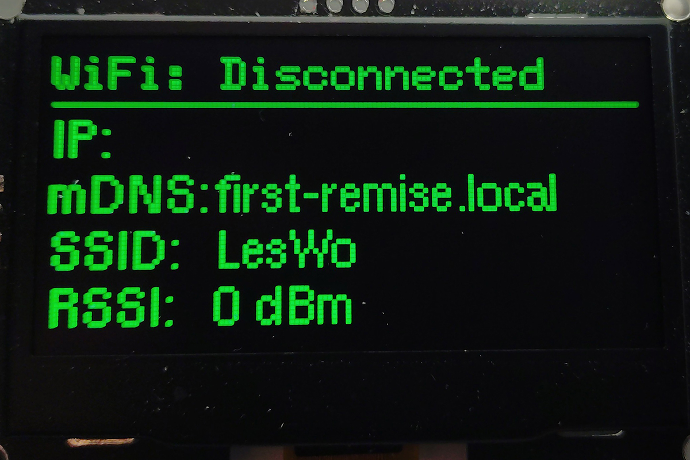</a>
    </td>
    <td valign="top">
      <a href="images/display/IMG_20260419_115042.jpg">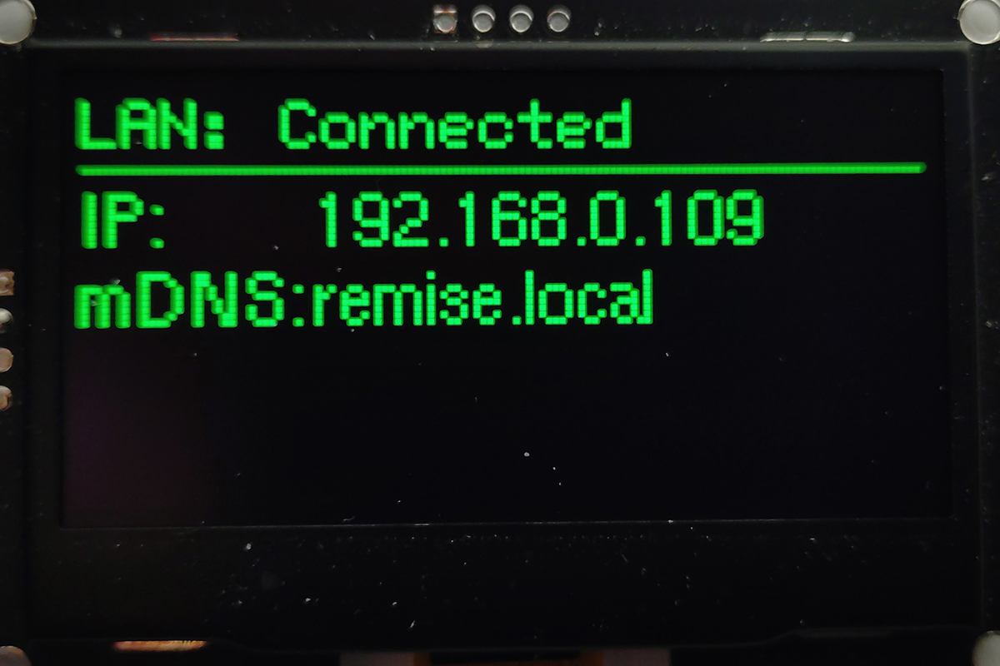</a>
    </td>
  </tr>
  <tr>
    <td valign="top">
      <a href="images/display/IMG_20260419_114903.jpg">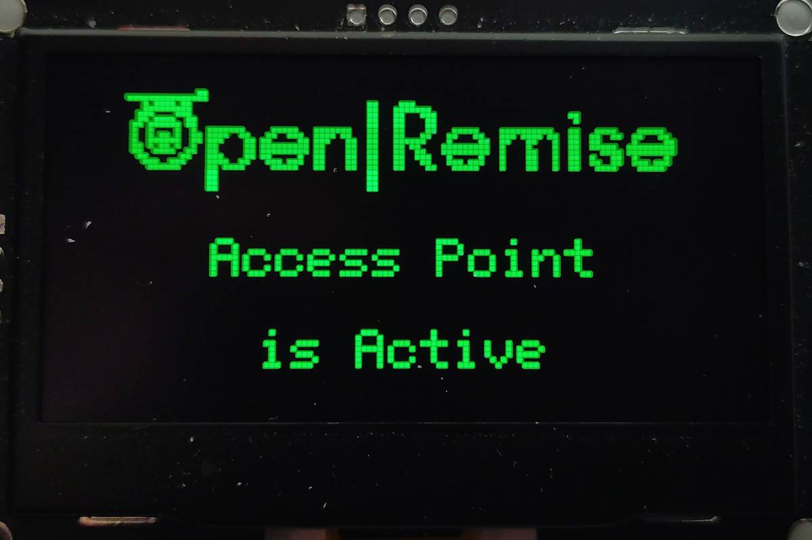</a>
    </td>
    <td valign="top">
      <a href="images/display/IMG_20260419_114934.jpg">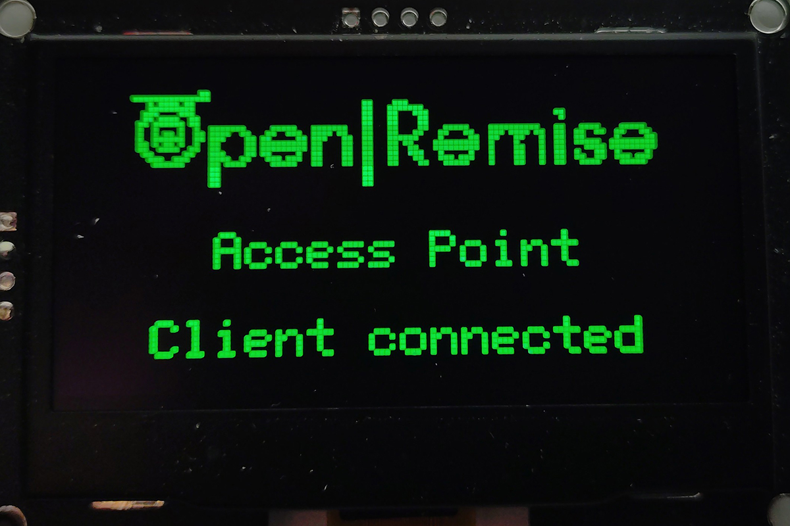</a>
    </td>
    <td valign="top">
      <a href="images/display/IMG_20260419_115459.jpg">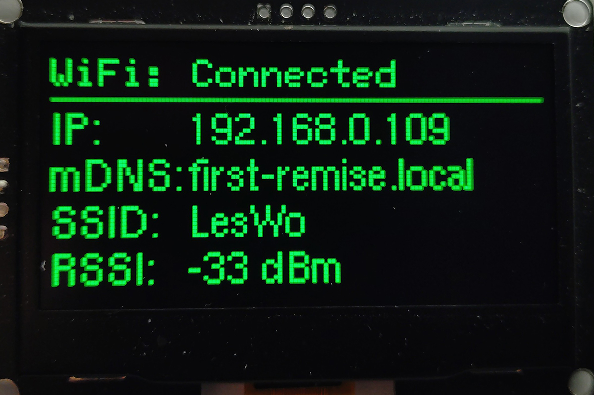</a>
    </td>
  </tr>
</table>

    